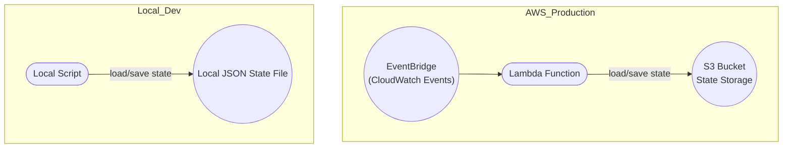

# Windows Container Image Checker


A script and AWS Lambda function to monitor Microsoft Windows container images on MCR, compare tags/digests, and report new or updated images.

---

## Features

- Checks a list of Windows container image repositories for updates
- Compares latest tags and digests
- Reports new images or updates since last run
- Can run locally (for development/testing) or as a scheduled AWS Lambda function (for production)

---

## Architecture

Below is the architecture for both local development and AWS Lambda production deployments:



- **Production:**
  EventBridge triggers the Lambda function on a schedule. Lambda loads the previous state from S3, checks for image updates, and saves the new state back to S3.
- **Development:**
  The script can be run locally, reading and writing state from a local JSON file.

---

## Configuration

1. **Configuration File:**
   Define the repositories to track in `config.json`:

   ```json
   {
     "repos": [
       "windows/servercore",
       "windows/nanoserver"
     ]
   }
   ```

2. **State Storage:**
   - **Local/Dev:** State (i.e., previous check results) is stored as a JSON file (`windows_container_state.json`) in the working directory.
   - **Production (Lambda):** State is stored in an S3 bucket as an object.

---

## Running Locally (Development / Testing)

- By default, the script will load/save state to a local JSON file.
- No AWS setup is required.
- Run with:
  ```sh
  python check_windows_containers.py
  ```

### Sample Output

When new container images are available:

```text
check_windows_containers.py
Checking Microsoft Windows container images at 2025-06-21T06:42:42.901613Z
Changes detected:
  [NEW] windows/server: tag=some-tag, digest=sha256:d0b929fbf30696db7cfa6af63cbfaa54964c2c583b6a77c934f015b5f3117fd1
```

When there are no changes:

```text
check_windows_containers.py
Checking Microsoft Windows container images at 2025-06-21T06:42:42.842400Z
No changes detected.
```

---

## Running in AWS Lambda (Production)

### 1. **Switch to S3 State Backend**

For production/Lambda deployments, **remove the local JSON state backend** and use the S3 backend for state storage.

- Use the provided `state_backend_s3.py` for clean S3 state management.
- Do not include or call the local JSON-based load/save functions in your deployed Lambda.

### 2. **Environment Variables**

Set these Lambda environment variables:

| Name         | Description                               | Example                        |
|--------------|-------------------------------------------|--------------------------------|
| `S3_BUCKET`  | Name of the S3 bucket for state storage   | `my-container-state-bucket`    |
| `STATE_KEY`  | (Optional) S3 object key for the state    | `windows_container_state.json` |

### 3. **IAM Permissions**

The Lambda execution role must have permissions for:
- `s3:GetObject`
- `s3:PutObject`
- (optionally) `s3:ListBucket`
for your chosen S3 bucket.

### 4. **Scheduling**

- Use Amazon EventBridge (CloudWatch Events) to trigger the Lambda on a schedule (e.g., every 4 hours).

### 5. **Lambda Handler Example**

Your deployed Lambda should import and use only the S3 backend:
```python
from state_backend_s3 import load_state, save_state

def lambda_handler(event, context):
    # Load repositories, e.g. from config.json in your deployment package or another source
    repos = load_config("config.json")
    old_state = load_state()
    new_state, updates = check_images(repos, old_state)
    # ... (report updates as needed) ...
    save_state(new_state)
    return {"status": "completed"}
```
**Remove or comment out any code that refers to local JSON files for state.**

---

## Notes

- The Lambda function and script logic are designed to support both local and production use-cases, but production deployments should **exclusively use the S3 backend** for state.
- If testing new features or debugging, use the local backend and then switch to S3 before deploying.

---

## License

[MIT](LICENSE)
